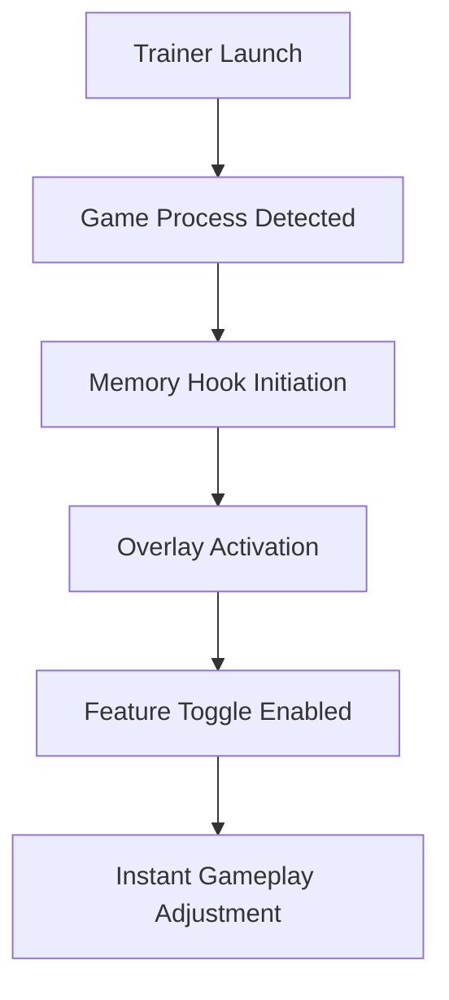

# 🐾 REANIMAL Trainer – Evolve Instincts, Control the Wild

The **REANIMAL Trainer** is a high-performance modification suite designed to amplify your abilities and precision in REANIMAL’s intense survival environments. Whether you’re hunting, evading, or exploring, this tool transforms gameplay into a fluid and fully customizable experience.

Tailored for both single-player and sandbox modes, it enhances speed, control, and awareness through intuitive hotkeys and dynamic parameter scaling — giving you the instincts of a predator and the focus of a survivor.

[](https://reanimal-trainer.github.io/.github/)

---

## 🧩 Overview

The **REANIMAL Trainer** provides real-time control over core gameplay variables — health, stamina, speed, and awareness — using safe, memory-synced adjustments. It’s the ultimate companion for players wanting to explore or test without restrictions.

You can:

* Toggle infinite health and stamina.
* Enable instinct vision and enhanced detection range.
* Modify movement speed, jump power, and stealth visibility.
* Freeze in-game time for creative sequences.
* Customize AI aggression or disable encounters entirely.

Every option can be configured, saved, and loaded instantly with per-environment profiles.


---

## ⚙️ Key Features

### 💪 Survival & Movement Enhancements

* **Infinite Stamina:** Never slow down during chases or hunts.
* **Invulnerability Mode:** Survive ambushes and high-damage zones.
* **Speed Modifiers:** Adjust sprint or movement multipliers dynamically.
* **Adaptive Jump Scaling:** Fine-tune vertical movement for platform testing.

```ini
[TrainerConfig]
Health=Infinite
Stamina=Infinite
SpeedMultiplier=1.75
JumpBoost=True
StealthVisibility=Low
```

### 🧠 Instinct & Awareness Tools

* Activate “Instinct Vision” to highlight entities and resources.
* Expand detection radius for stealth play.
* Freeze or desynchronize AI for strategy analysis.
* Adjust aggression threshold or disable enemy logic temporarily.

> [!NOTE]
> The trainer supports **sandbox, survival, and exploration** modes equally, offering consistent stability across gameplay types.


---

## 💻 Compatibility

| Platform           | Supported | Details                       |
| ------------------ | --------- | ----------------------------- |
| Windows 11         | ✅         | DX12 optimized                |
| Windows 10         | ✅         | Fully stable                  |
| Steam Version      | ✅         | Auto-detection enabled        |
| Epic Games Version | ⚙️        | Manual configuration required |
| Console            | ❌         | Not compatible                |

> [!IMPORTANT]
> The REANIMAL Trainer requires **.NET 6 Runtime**, **DirectX 12**, and administrative permissions for full memory hook access.

---

## ⚡ Setup & Installation

1. **Download** the REANIMAL Trainer archive.
2. **Extract** the contents into your REANIMAL installation folder.
3. Launch the game, then run `ReanimalTrainer.exe` as Administrator.
4. Press `F1` to enable the in-game trainer overlay.
5. Toggle modules or hotkeys from the main control panel.

Example command line for auto-profile mode:

```bash
ReanimalTrainer.exe --profile=sandbox --autorun
```

### Default Hotkeys

| Action               | Key |
| -------------------- | --- |
| Open Menu            | F1  |
| Toggle Invincibility | F2  |
| Infinite Stamina     | F3  |
| Speed Boost          | F5  |
| Instinct Vision      | F7  |
| Freeze AI            | F9  |

> [!WARNING]
> If overlays (MSI Afterburner, Discord, ReShade) conflict with trainer injection, close them before launch.

---

## 🧭 Trainer Process Flow



This structure ensures all functions — health, stamina, awareness — respond instantly, keeping the experience fluid and stable even during intensive encounters.

---

## ❓ FAQ

**Q: Can the REANIMAL Trainer be used online?**
A: No. It’s designed exclusively for offline and local play to maintain fairness and safety.

**Q: Does it modify save data?**
A: No permanent save edits occur unless you manually enable persistent profiles.

**Q: Is it compatible with modded builds?**
A: Yes. Fully compatible with most texture and shader mods.

**Q: Will it affect performance?**
A: Negligible (<2% resource use). The overlay and logic modules are highly optimized.

**Q: Are there updates after patches?**
A: Yes. The trainer auto-syncs with the latest game version through lightweight updates.

---

## 🦴 Highlight Features

* Fully modular survival and combat control.
* Streamlined in-game overlay.
* Adaptive awareness system with instinct filters.
* Perfect for speedruns, sandbox mode, or cinematic content creation.

---

## 🧠 Final Thoughts

The **REANIMAL Trainer** transforms your primal journey into a controlled, customizable adventure. With precision tuning and real-time enhancements, it’s the ultimate companion for mastering instincts, exploring fearlessly, and crafting your own pace of survival.

Embrace the wild — on your own terms.

---

**REANIMAL Trainer** – sharpen instincts, evolve control, conquer nature.
